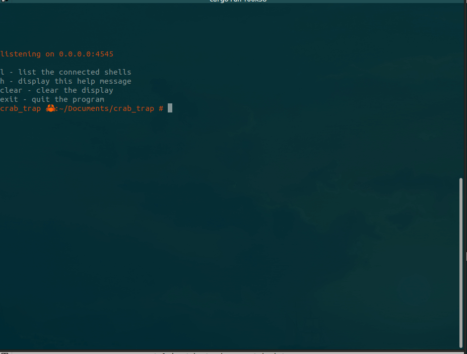
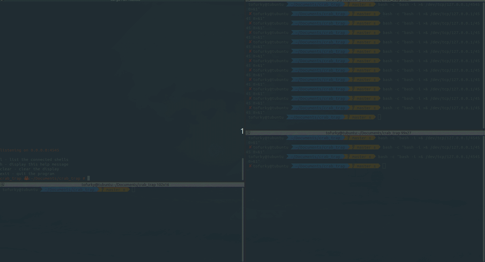
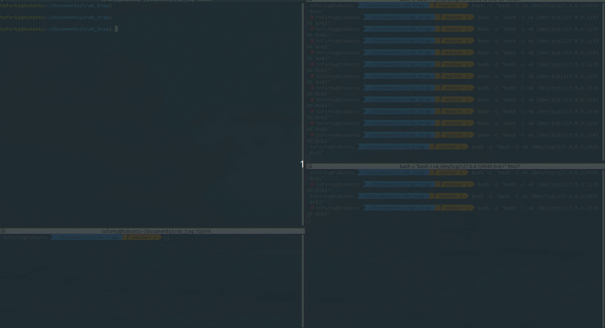

# crab_trap
A convenient lightweight reverse shell manager/c2.  
crab_trap allows to to capture multiple reverse shells in a single window.  
What's more? crab_trap allows you to easily make your pty sessions interactive, no more `stty raw -echo;fg` shenanigans.

other cool features:
- shell verification: crab_trap automatically verifies that a tcp connection is a shell before it adds it to your list
- shell aliasing, easily rename your shells
- ignores CTRL+c in non-interactive mode to stop you from accidentally closing your shell
- notifies when a new shell is received
- command history completion
- file/folder completion (except in non-interactive shell)

  
This project is still under active development, PRs are welcome 

## Note about text editors:
When in raw mode nano works fine but other editors like vi and vim don't  
I'm unsure as to why, some help here would be appreciated

## Main menu functionality:
The crab_trap main menu is fully interactive and supports any os command as well as file and history completion:

## Shell capture functionality:
crab_trap by default listens for shells on port 4545, this can be changed by `crab_trap <INTERFACE> <PORT>`. Once it receives a tcp connection, it sends an echo command, if the connection responds then it is likely a shell and it gets added to the list.  
Once a shell is added, a notification will display in the top left corner of the menu screen. To interact with the shell list, simply enter `l` into the menu.
 

## Interactive mode:
Once you have a tty go back to the shell list screen and highlight the shell with your tty. Press `r` on the highlighted shell and it will automatically set the tty rows and columns and then start raw mode

## TODO:
- Add support for multiple running instances (maybe a client/server architecture)
- Increase test coverage
- Fix rustyline prompt being erased in non-interactive mode
- Fix vim support in raw mode
